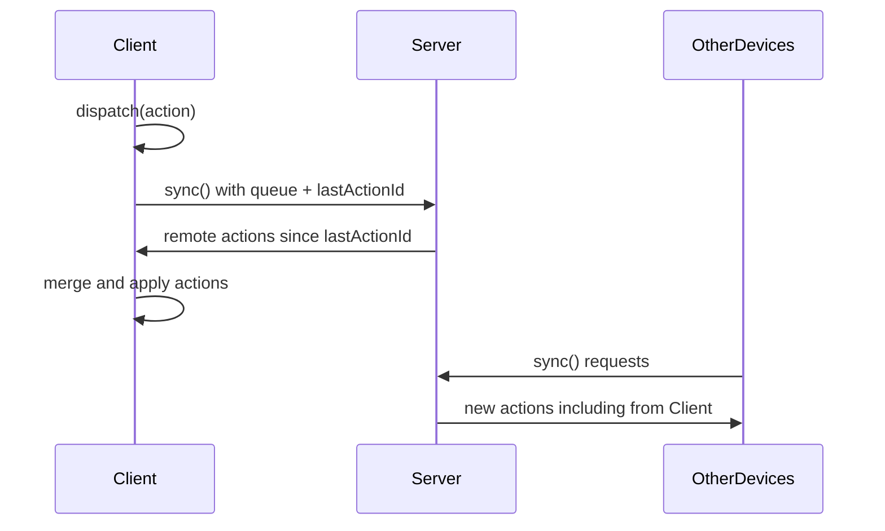
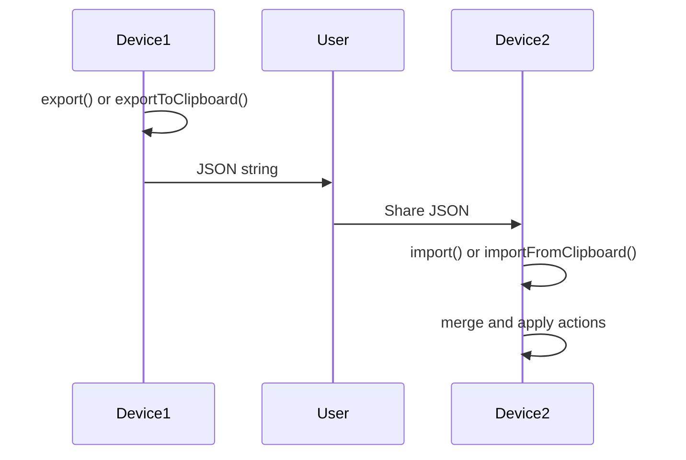

# ActionSync

A JavaScript module for synchronizing user actions across devices in real-time.

## Overview

ActionSync enables seamless synchronization of user actions across multiple devices by maintaining a queue of actions with unique identifiers and timestamps. When actions are replayed in the correct order on all devices, they remain perfectly synchronized.

## Features

- **Action Dispatch**: Queue actions with unique 64-bit IDs containing timestamps
- **Server Sync**: Automatic synchronization with remote server
- **Manual Export/Import**: JSON-based manual synchronization
- **Clipboard Integration**: Easy sharing via system clipboard
- **Deterministic Ordering**: Timestamp-based action ordering ensures consistency

## Core Concepts

### Action Structure
Each action is automatically enhanced with:
- `actionId`: 64-bit unique identifier with timestamp in leftmost bits
- `timestamp`: Creation time for ordering
- `payload`: Original action data

### Synchronization Model
1. Actions are dispatched locally and queued
2. Sync process exchanges actions with server/other devices
3. Actions are applied in timestamp order across all devices
4. Deterministic replay ensures consistent state

## API Reference

### `dispatch(action)`
Adds an action to the local queue with a unique identifier.

**Parameters:**
- `action` (Object): The action object to dispatch

**Returns:**
- `actionId` (String): The generated unique action ID

**Example:**
```javascript
const actionId = actionSync.dispatch({
  type: 'USER_CLICK',
  target: 'button-1',
  coordinates: { x: 100, y: 200 }
});
```

### `sync()`
Synchronizes the local action queue with the remote server.

**Returns:**
- `Promise<Object>`: Sync result containing applied actions and status

**Process:**
1. Sends local queue to server along with last known action ID
2. Receives remote actions that occurred since last sync
3. Merges and orders actions by timestamp
4. Returns list of newly applied actions

**Example:**
```javascript
const result = await actionSync.sync();
console.log(`Applied ${result.appliedActions.length} new actions`);
```

### `export()`
Exports the current action queue as a JSON string for manual sharing.

**Returns:**
- `String`: JSON representation of the action queue

**Example:**
```javascript
const exportData = actionSync.export();
// Share exportData via email, file, etc.
```

### `import(jsonString)`
Imports actions from a JSON string and merges them with the local queue.

**Parameters:**
- `jsonString` (String): JSON data from export()

**Returns:**
- `Object`: Import result with count of imported actions

**Example:**
```javascript
const result = actionSync.import(jsonString);
console.log(`Imported ${result.importedCount} actions`);
```

### `exportToClipboard()`
Exports the action queue and copies it to the system clipboard.

**Returns:**
- `Promise<Boolean>`: Success status

**Example:**
```javascript
const success = await actionSync.exportToClipboard();
if (success) {
  console.log('Actions copied to clipboard');
}
```

### `importFromClipboard()`
Imports actions from the system clipboard.

**Returns:**
- `Promise<Object>`: Import result or error if clipboard doesn't contain valid data

**Example:**
```javascript
try {
  const result = await actionSync.importFromClipboard();
  console.log(`Imported ${result.importedCount} actions from clipboard`);
} catch (error) {
  console.error('Failed to import from clipboard:', error.message);
}
```

## Action ID Format

The 64-bit action ID is structured as follows:
```
[48-bit timestamp][16-bit counter/random]
```

- **Timestamp (48 bits)**: Milliseconds since epoch, providing natural ordering
- **Counter/Random (16 bits)**: Ensures uniqueness for actions created simultaneously

This format ensures:
- Chronological ordering across devices
- Uniqueness even with concurrent actions
- Efficient comparison and sorting

## Synchronization Flow

### Automatic Sync


### Manual Sync


## Usage Examples

### Basic Usage
```javascript
import ActionSync from 'actionsync';

const actionSync = new ActionSync({
  serverUrl: 'https://api.example.com/sync',
  deviceId: 'device-123'
});

// Dispatch actions
actionSync.dispatch({ type: 'BUTTON_CLICK', id: 'save-btn' });
actionSync.dispatch({ type: 'TEXT_INPUT', field: 'username', value: 'john' });

// Sync with server
await actionSync.sync();
```

### Manual Sharing
```javascript
// On device 1
const exportData = actionSync.export();
console.log('Share this data:', exportData);

// On device 2
actionSync.import(exportData);
```

### Clipboard Sharing
```javascript
// On device 1
await actionSync.exportToClipboard();
console.log('Actions copied to clipboard');

// On device 2
await actionSync.importFromClipboard();
console.log('Actions imported from clipboard');
```

## Configuration

### Constructor Options
```javascript
const actionSync = new ActionSync({
  serverUrl: 'https://api.example.com/sync',  // Required
  deviceId: 'unique-device-id',               // Required
  autoSync: true,                             // Auto-sync on dispatch
  syncInterval: 30000,                        // Auto-sync interval (ms)
  maxQueueSize: 1000,                         // Max actions in queue
  retryAttempts: 3,                           // Sync retry attempts
  debug: false                                // Enable debug logging
});
```

## Error Handling

All async operations include proper error handling:

```javascript
try {
  await actionSync.sync();
} catch (error) {
  if (error.code === 'NETWORK_ERROR') {
    // Handle network issues
  } else if (error.code === 'INVALID_RESPONSE') {
    // Handle server errors
  }
}
```

## Best Practices

1. **Regular Syncing**: Call `sync()` frequently to minimize conflicts
2. **Unique Device IDs**: Ensure each device has a unique identifier
3. **Action Granularity**: Keep actions small and atomic
4. **Error Recovery**: Implement retry logic for failed syncs
5. **Data Validation**: Validate imported data before applying

## Implementation Notes

- Actions are stored in memory by default
- Persistence layer can be added for offline support
- Conflict resolution uses timestamp ordering
- Server should implement idempotent action processing
- Consider rate limiting for sync requests

## Dependencies

- Modern browser with Clipboard API support (for clipboard functions)
- Fetch API for server communication
- ES6+ JavaScript environment

## License

MIT 